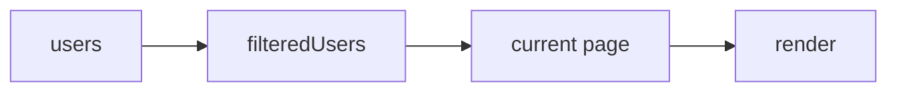
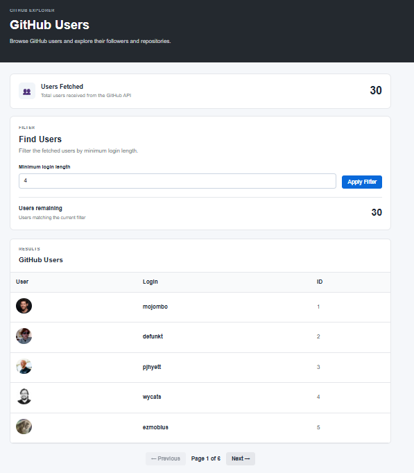
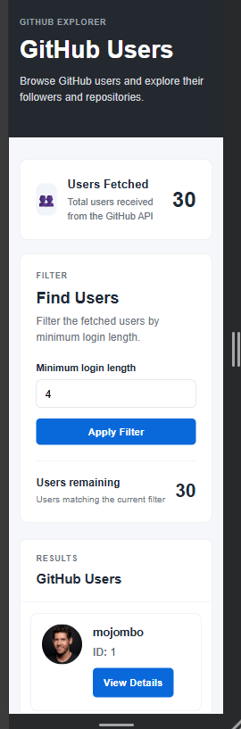
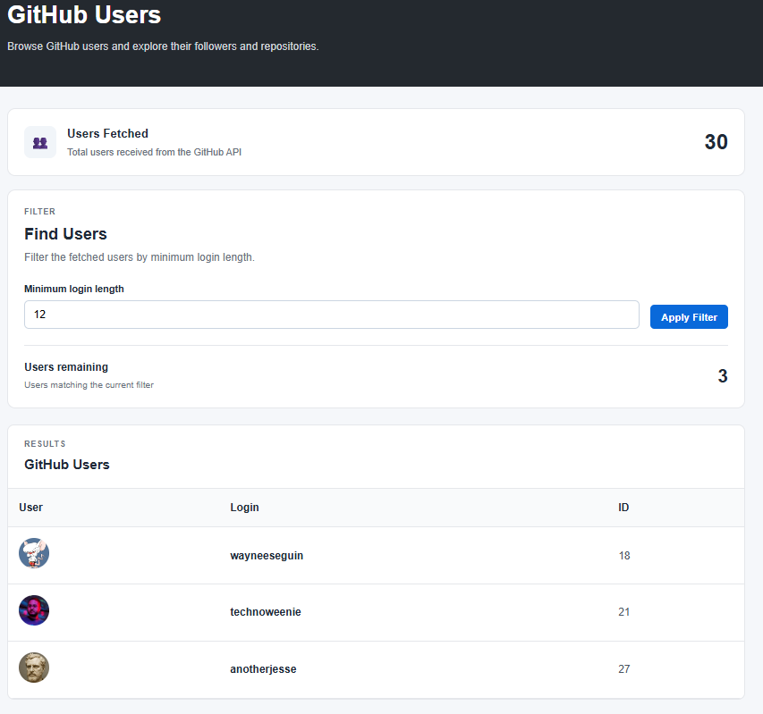
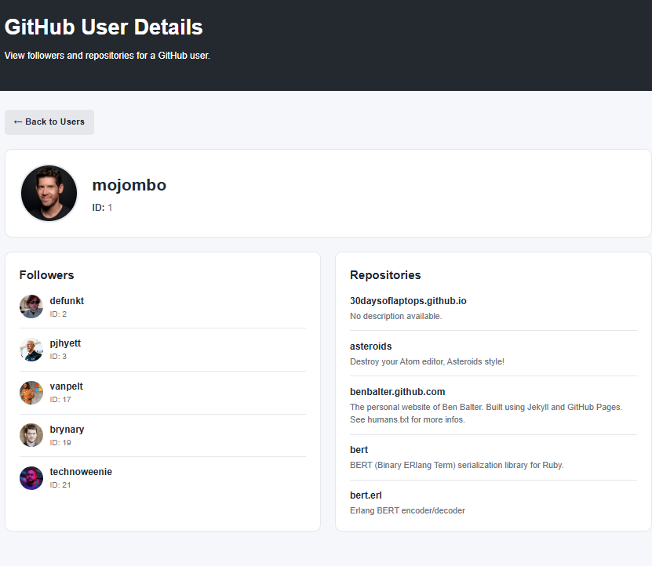
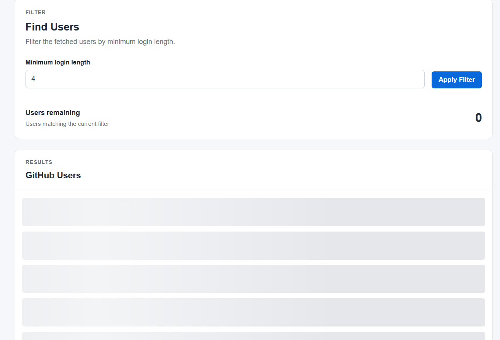

# AFDP Advanced JS Assignment

Name - Anurag Chandra Technical - AFDP 2026 Path 2

# GitHub Users Explorer - Advanced JS Assignment

A frontend JavaScript application that consumes the GitHub Users API to display, filter, paginate, and explore GitHub users.

## Features

- Fetch GitHub users on page load.
- Display fetched and filtered user counts.
- Filter users by minimum login length.
- Paginate users with 5 users per page.
- Responsive desktop table and mobile card layout.
- View individual user details.
- Fetch first 5 followers and repositories in parallel.
- Loading skeletons and user-friendly error handling.

## Approach

The application was built in separate stages:

1. Fetch users from the GitHub API using `async/await`.
2. Validate the API response and transform the data to only `login`, `id`, and `avatar`.
3. Store the fetched data and use it for filtering and pagination without making additional API requests.
4. Render users dynamically based on the current page and filter.
5. Open a details page for the selected user.
6. Fetch followers and repositories simultaneously using `Promise.all()`.
7. Handle loading, empty, and error states throughout the application.
```text
    OVERALL DATA FLOW

    GitHub API
        ↓
    Fetch & Validate
        ↓
    Transform Data
        ↓
    Fetched Users
        ↓
    Filter
        ↓
    Filtered Users
        ↓
    Pagination
        ↓
    Render UI
        ↓
    User Details
        ↓
    Followers + Repositories
        ↓
    Promise.all()
```


## File Structure

```text
Advanced JS Assignment/
│
├── index.html
├── details.html
│
├── css/
│   └── style.css
│
├── js/
│   ├── api.js
│   ├── users.js
│   └── details.js
│
└── README.md
```

| File           | Purpose                                                       |
| -------------- | ------------------------------------------------------------- |
| `index.html`   | User list, filter, count and pagination UI                    |
| `details.html` | Selected user's details, followers and repositories           |
| `style.css`    | Responsive layout, table/cards, loading skeletons and styling |
| `api.js`       | GitHub API requests and response transformation               |
| `users.js`     | List-page state, filtering, pagination and rendering          |
| `details.js`   | Details-page logic and parallel API requests                  |
| `README.md`    | Project documentation                                         |


## Important Implementation Logic

### API Fetching

`api.js` uses `async/await` and checks `response.ok` before processing the response.

```javascript
const response = await fetch(url);

if (!response.ok) {
    throw new Error(`Request failed: ${response.status}`);
}
```

### Data Transformation

Only the required fields are retained from the GitHub response:

```javascript
return users.map(user => ({
    login: user.login,
    id: user.id,
    avatar: user.avatar_url
}));
```

### Filtering & Pagination

The original fetched array is preserved. Filtering creates a separate filteredUsers array, which is then paginated using slice().


Five users are displayed per page.

### Parallel Requests

The details page fetches followers and repositories simultaneously:

```javascript
const [followers, repositories] = await Promise.all([
    fetchFollowers(username),
    fetchRepositories(username)
]);
```
### Error & Loading States

The application handles different UI states during API requests:

- **Loading:** A skeleton UI is shown while data is being fetched.
- **Success:** The skeleton is removed and the fetched data is rendered.
- **Error:** API/network failures are caught using `try/catch` and a friendly error message is displayed instead of leaving the page blank.
- **Retry:** The user can retry the request from the error state.
- **Empty:** A separate message is shown when no users match the applied filter.

The loading skeleton is hidden in the `finally` block so it is removed whether the request succeeds or fails.

```javascript
try {
    users = await fetchUsers();
    renderUsers(users);
} catch (error) {
    console.error(error);
    showError();
} finally {
    hideLoading();
}
```
## Design & Responsive Decisions

- Desktop uses a table layout for efficient comparison of users.
- Mobile converts each user into a card to improve readability on smaller screens.
- The desktop table does not include a separate action column; the entire row is clickable.
- Mobile cards include a `View Details` button.
- Loading skeletons are used instead of leaving the page blank during API requests.
- The UI includes separate states for loading, error, empty results, and successful results.

## Screenshots

### Desktop User List



### Mobile User List

**Only Mobile View has the `View Details` button**




### Filtered Users




### User Details



### Loading State



## Setup & Run

### Prerequisites

- A modern web browser
- VS Code with Live Server (recommended)

### Run Locally

1. Clone the repository.
2. Open the project in VS Code.
3. Start the project using Live Server.
4. Open `index.html` in the browser.

The application uses the GitHub REST API directly, so no backend or environment variables are required.

## Assignment Requirements

| Requirement | Status |
|---|---|
| Fetch GitHub users on page load | ✅ |
| Display fetched user count | ✅ |
| Use `async/await` | ✅ |
| Validate API responses | ✅ |
| Transform API data | ✅ |
| Filter by minimum login length | ✅ |
| Display filtered user count | ✅ |
| Pagination with 5 users per page | ✅ |
| Loading skeleton | ✅ |
| Graceful error handling | ✅ |
| Responsive desktop/mobile layout | ✅ |
| User details page | ✅ |
| Fetch first 5 followers | ✅ |
| Fetch first 5 repositories | ✅ |
| Parallel requests using `Promise.all()` | ✅ |
| Back to users functionality | ✅ |

