# AFDP Advanced JavaScript & TypeScript Assignment

**Name:** Anurag Chandra\
**Program:** AFDP 2026 --- Path 2

# GitHub Explorer Enhancement

A TypeScript-based frontend application that extends the existing GitHub
Users Explorer with two focused features:

1.  **Users Page --- in-place search and sorting**
2.  **Repository Search --- GitHub repository search with pagination**

The project uses the GitHub REST API and demonstrates practical
TypeScript concepts including interfaces, generics, union types,
nullable types, typed DOM events, immutable data transformation,
async/await, and loading/empty/error handling.

------------------------------------------------------------------------

## Features

### Users Page

-   Fetch GitHub users using the existing Users API.
-   Fetch users in pages of **30** using the GitHub `since` parameter.
-   Search the currently loaded users by **login**.
-   Search updates the visible list without making another API request.
-   Sort the currently visible users by login:
    -   A → Z
    -   Z → A
-   Search and sorting work together.
-   Pagination fetches the next/previous set of users from the API.
-   Search and sorting are reapplied to newly fetched users.
-   Original API data is not mutated.
-   Clear empty state when no users match the search.
-   Responsive desktop table and mobile card layout.
-   User rows support navigation to the details page.

> The assignment originally describes the Users endpoint using `page`.
> After clarification, pagination for this implementation uses the
> GitHub `since` parameter while preserving the required page-by-page
> behaviour.

### User Details Page

-   Displays the selected user's login and ID.
-   Displays the user's avatar.
-   Fetches the first 5 followers.
-   Fetches the first 5 repositories.
-   Followers and repositories are requested independently using
    `Promise.allSettled()`.
-   One section can succeed even if the other fails.
-   Loading skeleton, empty state, and error handling are supported.

### Repository Search Page

-   New `repositories.html` page.
-   Search GitHub repositories by name or keyword.
-   Displays:
    -   Repository name
    -   Description
    -   Owner login
    -   Star count
    -   Programming language
    -   View on GitHub link
-   Uses `page` and `per_page=10` for pagination.
-   Does not call the API for an empty search query.
-   Displays an empty-results message when GitHub returns zero items.
-   Displays API/HTTP errors without rendering partial results.
-   Handles network failures.
-   Loading state is always cleared using `finally`.
-   Repository API data is transformed into a small display model before
    rendering.

------------------------------------------------------------------------

# Architecture

The application follows a simple separation of responsibilities:

``` text
                    GitHub REST API
                          │
                          ▼
                    ApiService
                          │
                          ▼
                  Generic apiRequest<T>()
                          │
                          ▼
                  Page / Application Logic
                     │             │
                     ▼             ▼
              Transform Data    DOM Rendering
```

For repository search:

``` text
Repository Search Form
        │
        ▼
repositories.ts
        │
        ▼
ApiService.searchRepositories()
        │
        ▼
apiRequest<T>()
        │
        ▼
GitHub Repository Search API
        │
        ▼
GitHub response
        │
        ▼
transformRepositorySearchResults()
        │
        ▼
DisplayRepositorySearch[]
        │
        ▼
Render repository rows/cards
```

------------------------------------------------------------------------

# Project Structure

``` text
Advanced JS Assignment/
│
├── css/
│   └── style.css
│
├── dist/
│   ├── details.js
│   ├── repositories.js
│   ├── users.js
│   └── ...
│
├── src/
│   ├── services/
│   │   └── apiService.ts
│   │
│   ├── types/
│   │   ├── apidomain.ts
│   │   └── github.ts
│   │
│   ├── utils/
│   │   ├── api.ts
│   │   ├── dom.ts
│   │   └── transformerFunctions.ts
│   │
│   ├── details.ts
│   ├── repositories.ts
│   └── users.ts
│
├── screenshots/
│
├── index.html
├── details.html
├── repositories.html
├── package.json
├── package-lock.json
├── tsconfig.json
└── README.md
```

### Responsibility of each layer

  -------------------------------------------------------------------------
  File / Folder                         Responsibility
  ------------------------------------- -----------------------------------
  `src/types/`                          TypeScript API, display-model, and
                                        application types

  `src/utils/api.ts`                    Generic typed HTTP request helper

  `src/utils/dom.ts`                    Reusable typed DOM element helper

  `src/utils/transformerFunctions.ts`   Converts API models into UI display
                                        models

  `src/services/apiService.ts`          GitHub-specific API operations

  `src/users.ts`                        Users page search, sorting,
                                        pagination, state, and rendering

  `src/repositories.ts`                 Repository search, pagination,
                                        state, and rendering

  `src/details.ts`                      User details, followers,
                                        repositories, and independent error
                                        handling

  `dist/`                               Compiled JavaScript generated by
                                        TypeScript

  `css/`                                Responsive application styling

  `index.html`                          Users page

  `details.html`                        User details page

  `repositories.html`                   Repository search page

  `screenshots/`                        Application screenshots

  `README.md`                           Project documentation
  -------------------------------------------------------------------------

------------------------------------------------------------------------

# TypeScript Implementation

## Interfaces and Display Models

API responses and UI data use separate types.

The repository search response contains only the fields needed by the
application, including `total_count` and the repository fields used by
the UI.

A separate display model is used before rendering:

``` ts
export interface DisplayRepositorySearch {
    name: string;
    description: string | null;
    owner: string;
    starCount: number;
    programmingLanguage: string | null;
    githubUrl: string;
}
```

This prevents the UI from depending directly on the complete GitHub
payload.

------------------------------------------------------------------------

## Generic API Helper

The shared API helper is generic and contains **no GitHub-specific
logic**.

It:

-   Uses `fetch` with `async/await`.
-   Accepts a URL and reusable request options/domain information.
-   Checks `response.ok`.
-   Returns typed API data.
-   Provides useful error information for HTTP failures.
-   Handles network failures separately.

The generic helper is reused by `ApiService` for users, followers,
repositories, and repository search.

------------------------------------------------------------------------

# ApiService

`ApiService` is the only layer responsible for GitHub-specific API
endpoints.

It provides methods for:

``` ts
getUsers()
getFollowers(username)
getRepositories(username)
searchRepositories(query, page)
```

The repository search method builds:

``` text
/search/repositories?q=<query>&page=<page>&per_page=10
```

The service does not access the DOM or render UI.

------------------------------------------------------------------------

# Data Transformation

GitHub API data is mapped into smaller UI models before rendering.

``` text
GitHub API response
        ↓
       map()
        ↓
Display model
        ↓
      render
```

Examples include:

``` ts
transformUsers()
transformRepositories()
transformRepositorySearchResults()
```

The repository search transformation produces only the fields required
by the page.

The original API arrays are not mutated.

------------------------------------------------------------------------

# Users Page --- Search and Sort

The Users page performs search and sorting on the users that are already
loaded.

``` text
GitHub API
    ↓
30 users loaded
    ↓
Search/filter
    ↓
Sort
    ↓
Render
```

No API request is made when the user changes the search text or sort
order.

The source list is preserved and a new derived array is created using
operations such as `filter()` and `sort()` on a copied array where
required.

The clarified pagination implementation uses GitHub's `since` parameter
to request the next set of users.

------------------------------------------------------------------------

# Repository Search

The repository page starts with no API request.

A request is made only after the user submits a non-empty search query.

``` text
Empty page
    ↓
User enters query
    ↓
Submit
    ↓
Validate query
    ↓
ApiService.searchRepositories()
    ↓
Transform results
    ↓
Render
```

Each page requests 10 repositories.

Pagination uses:

``` text
page=1
page=2
page=3
...
```

and:

``` text
per_page=10
```

The total number of pages is derived from `total_count`.

------------------------------------------------------------------------

# Repository Search UI States

The page supports all required states.

### Initial state

No repository search is performed when the page first opens.

### Loading

A loading skeleton is displayed while a search request is in progress.

### Success

Repository rows are rendered after successful data transformation.

### Empty results

When the API returns zero items:

``` text
No repositories found.
```

is displayed.

### Empty search query

Submitting an empty search does not call the API. A validation message
is shown and the previous repository results are cleared so the page
returns to its initial/no-results state.

### Error

HTTP/API and network failures are displayed to the user.

Partial repository results are not rendered when the API request fails.

### Loading cleanup

The loading skeleton is removed in `finally`, so it is cleared after
both successful and failed requests.

------------------------------------------------------------------------

# User Details and Independent Requests

The User Details page continues to use its existing independent API
behaviour.

Followers and repositories are requested together:

``` ts
const [followers, repositories] =
    await Promise.allSettled([
        apiService.getFollowers(username),
        apiService.getRepositories(username)
    ]);
```

Each result is checked independently.

This allows states such as:

``` text
Followers       Successful
Repositories    Failed
```

or:

``` text
Followers       Failed
Repositories    Successful
```

without unnecessarily hiding the successful section.

------------------------------------------------------------------------

# Typed DOM Events

DOM elements are explicitly typed, for example:

``` ts
const searchInput: HTMLInputElement =
    getElement("repository-search");

const searchButton: HTMLButtonElement =
    getElement("repository-search-button");

const searchForm: HTMLFormElement =
    getElement("repository-search-form");
```

The repository search form uses a typed `SubmitEvent`:

``` ts
searchForm.addEventListener(
    "submit",
    (event: SubmitEvent) => {
        event.preventDefault();
        // ...
    }
);
```

Other relevant UI interactions use appropriately typed DOM elements and
event handlers.

------------------------------------------------------------------------

# Error Handling

The application distinguishes between expected API failures and
unexpected failures.

## HTTP/API error

When the response is unsuccessful, the API helper returns the API error
information and the page displays it without rendering a partial list.

## Network error

Network failures are caught by `try/catch` and an appropriate error
message is displayed.

## Empty response

A successful response with zero repository items is treated as an empty
state rather than an error.

## Details-page independent errors

Followers and repositories are handled independently using
`Promise.allSettled()`.

------------------------------------------------------------------------

# Responsive Design

The existing visual design was preserved and extended for the repository
page.

### Users page

-   Desktop: users are displayed as table rows.
-   Mobile: each user becomes a card.
-   Mobile cards include a `View Details` action.

### Repository page

-   Desktop: repositories are displayed in table rows.
-   Repository description is displayed beneath the repository name in
    the same row.
-   Mobile: repository rows adapt into rectangular card-like layouts.
-   Every repository includes a `View on GitHub` action.

No CSS framework or additional library was introduced.

------------------------------------------------------------------------

# Screenshots

## Users Feature

### Initial User List

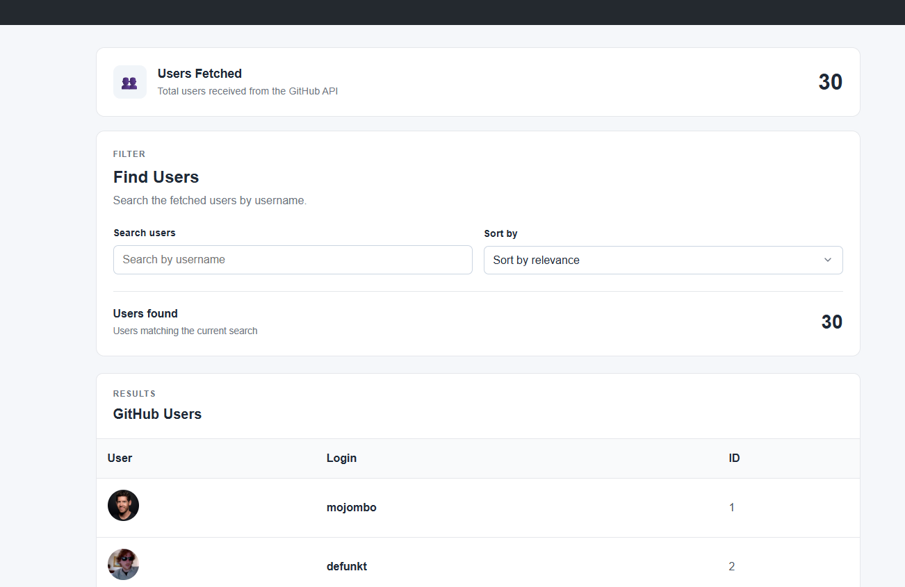

### User Search

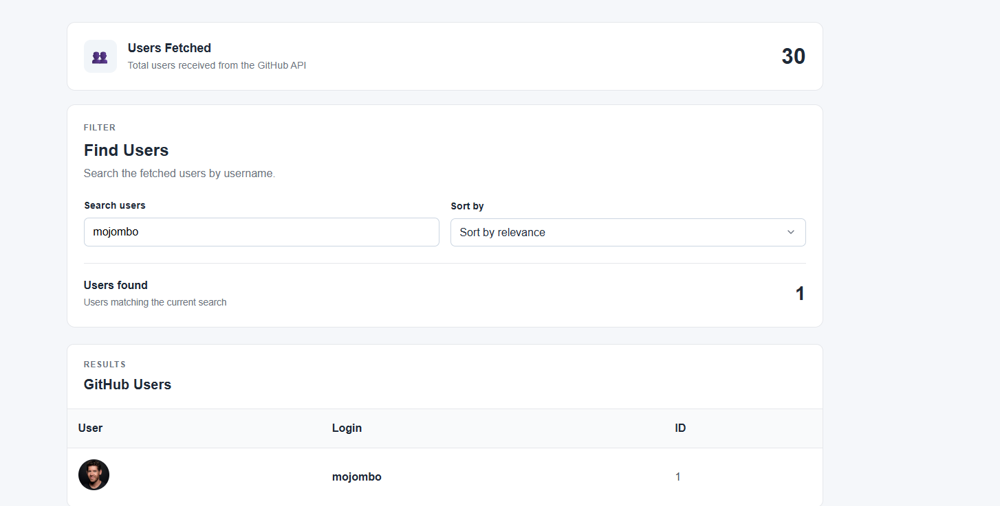

### User Sort


### Filtered Users


### No Users Found

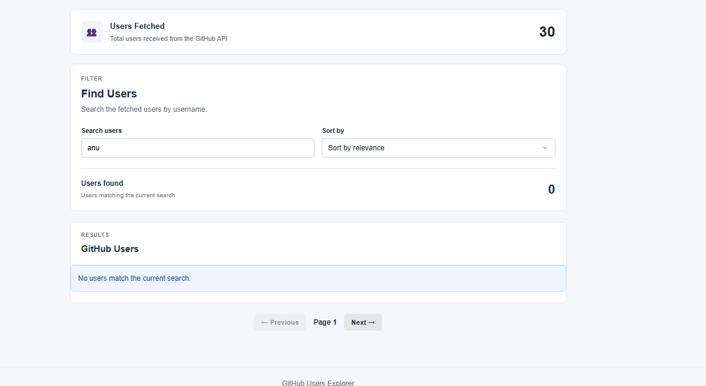

### Desktop User List


### Mobile User List


### User Fetch Error

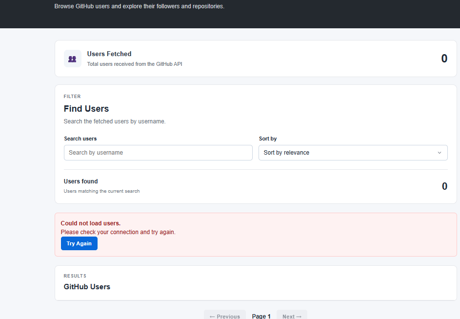

------------------------------------------------------------------------

## User Details

### User Details


### Followers and Repositories --- Both Successful

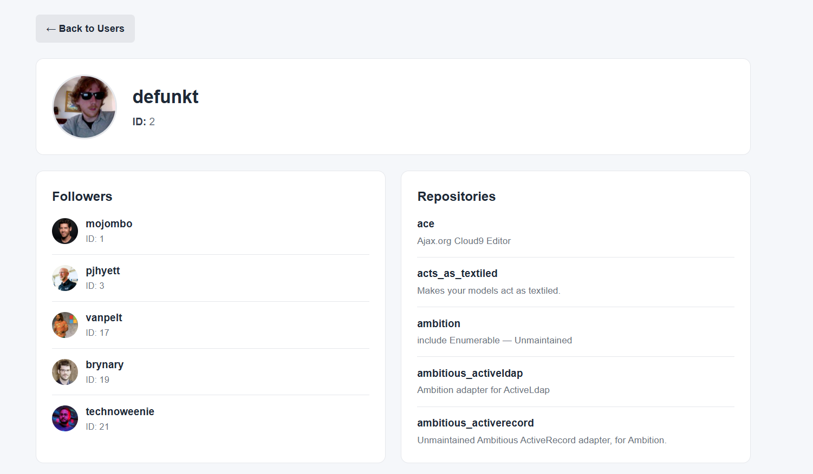

### Followers Failed, Repositories Successful

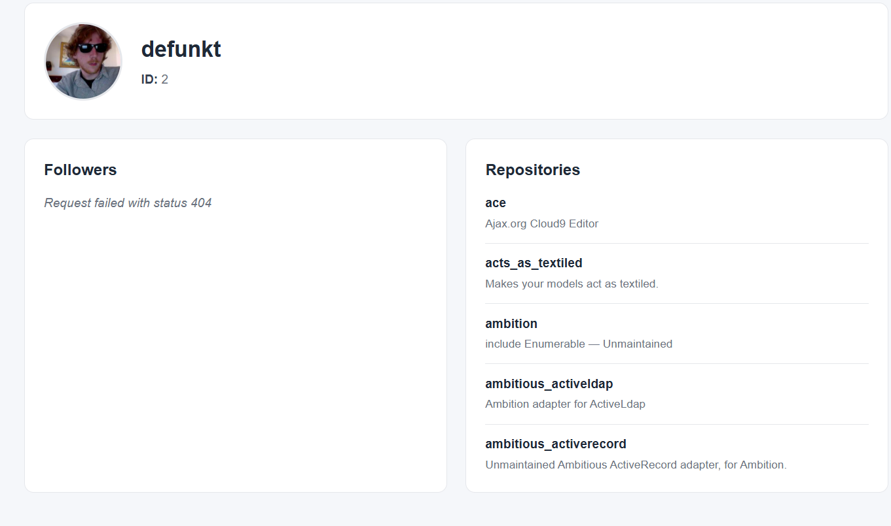

### Followers Successful, Repositories Failed

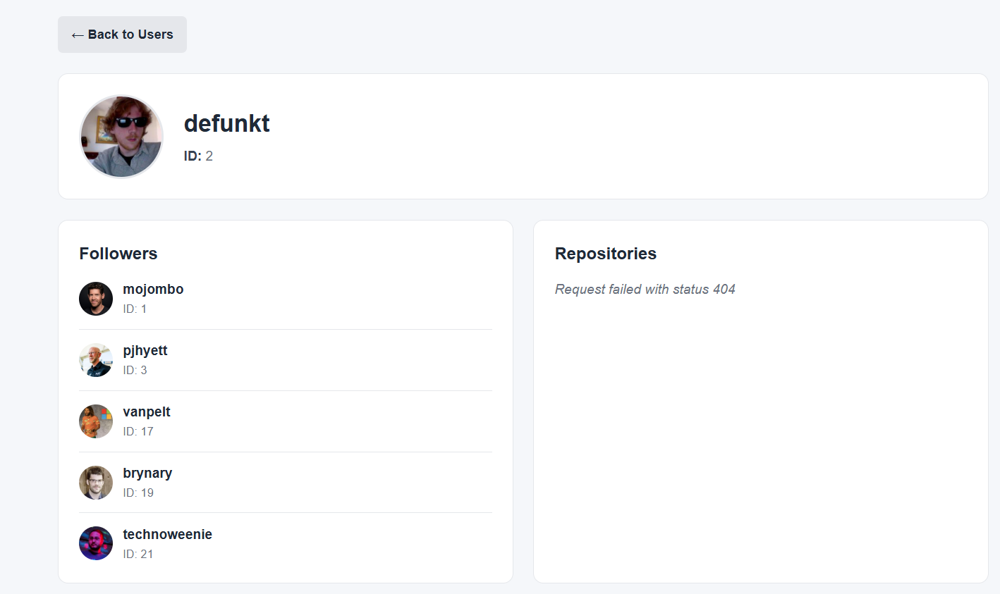

### Both Requests Failed

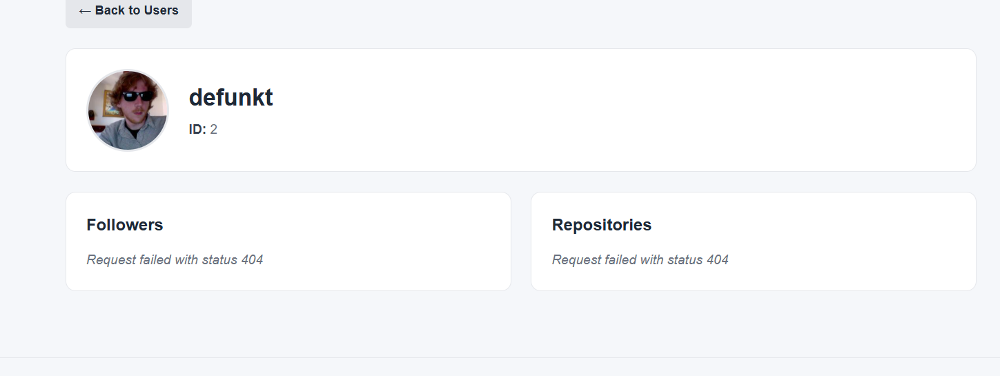

------------------------------------------------------------------------

## Repository Search Feature

### Initial Repository Page

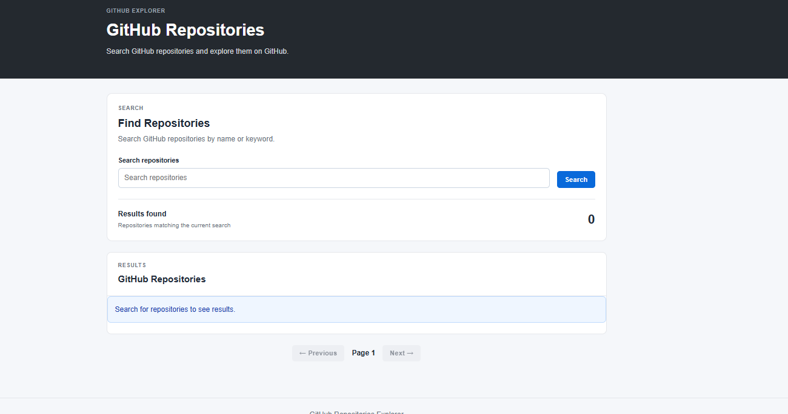

### Repository Search

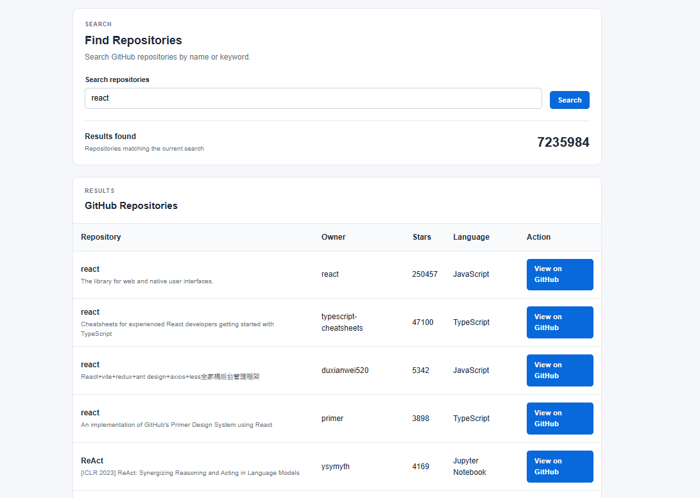

### Repository Fetch Error

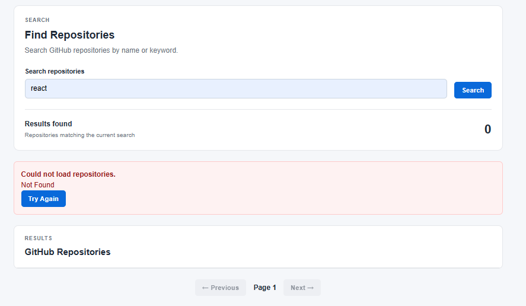

### No Repositories Found


### Loading Skeleton


------------------------------------------------------------------------

# Build and Run

## Prerequisites

-   Node.js and npm
-   A modern web browser
-   VS Code with Live Server or another local HTTP server

## Install Dependencies

``` bash
npm install
```

## Compile TypeScript

``` bash
npx tsc
```

The command must complete with **zero TypeScript errors** and generates
the compiled JavaScript in `dist/`.

## Run the Application

Serve the project using a local HTTP server.

Open:

``` text
index.html
```

for the Users page.

The repository search page is:

``` text
repositories.html
```

The browser loads the compiled JavaScript files from `dist/`.

After modifying TypeScript files, compile again:

``` bash
npx tsc
```

------------------------------------------------------------------------

# Assignment Requirement Checklist

  Requirement                                               Status
  --------------------------------------------------------- --------
  Remove minimum login length filter                       | ✅
  In-place user search                                     | ✅
  Search by available user field (`login`)                 | ✅
  A → Z sorting                                            | ✅
  Z → A sorting                                            | ✅
  Search and sorting work together                         | ✅
  No extra API request for user search/sort                | ✅
  Preserve original API response data                      | ✅
  Users pagination preserved                               | ✅
  Pagination implemented using clarified `since` approach  | ✅
  Clear user empty state                                   | ✅
  New `repositories.html` page                             | ✅
  Repository name                                          | ✅
  Nullable repository description                          | ✅
  Owner login                                              | ✅
  Star count                                               | ✅
  Nullable programming language                            | ✅
  GitHub repository link                                   | ✅
  Repository loading state                                 | ✅
  Repository success state                                 | ✅
  Repository empty state                                   | ✅
  Repository error state                                   | ✅
  Empty search validation                                  | ✅
  No API request for empty repository query                | ✅
  HTTP error handling                                      | ✅
  Network error handling                                   | ✅
  No partial list on API failure                           | ✅
  Repository pagination with `page` and `per_page`         | ✅
  Generic API helper                                       | ✅
  No GitHub-specific logic in generic helper               | ✅
  Repository logic kept in `ApiService`                    | ✅
  API data transformed before rendering                    | ✅
  Immutable/derived data handling                          | ✅
  Typed DOM elements                                       | ✅
  Typed search form event                                  | ✅
  TypeScript interfaces                                    | ✅
  Type aliases / union types where appropriate             | ✅
  Generic API helper                                       | ✅
  Nullable/optional types                                  | ✅
  Type narrowing                                           | ✅
  `async/await`                                            | ✅
  `try/catch/finally`                                      | ✅
  User Details page preserved                              | ✅
  `npx tsc` compiles with zero errors                      | ✅

------------------------------------------------------------------------

# Testing

The application was tested for the required scenarios.

### Users

-   Users load successfully.
-   Search filters the currently loaded users without an API request.
-   Sorting changes the currently visible order.
-   Search and sorting work together.
-   No-match search displays an empty state.
-   Pagination loads another set of users.
-   Search/sort behaviour continues after changing pages.
-   Desktop and mobile layouts were checked.
-   User API failure displays an error state.

### User Details

-   User details load successfully.
-   Followers load successfully.
-   Repositories load successfully.
-   Followers and repositories can fail independently.
-   Both requests can fail without leaving the page in a loading state.
-   Loading skeleton is cleared after completion.

### Repository Search

-   Initial page does not make a search request.
-   Valid search displays repositories.
-   Repository fields are displayed correctly.
-   Pagination works using `page` and `per_page=10`.
-   Empty search is validated without an API request.
-   Zero-result searches display `No repositories found.`
-   HTTP/API errors display an error message.
-   Network errors are caught and displayed.
-   Partial results are not rendered after an API failure.
-   Loading skeleton is removed after success and failure.

------------------------------------------------------------------------

# Out of Scope

The implementation intentionally does not add:

-   Authentication or tokens
-   Rate-limit quota changes
-   Additional GitHub endpoints beyond the existing Users/Details
    endpoints and Repository Search
-   Server-side search for the Users page
-   New frameworks or libraries
-   A rewrite of the existing User Details page
-   Unnecessary TypeScript features that do not solve a real problem
